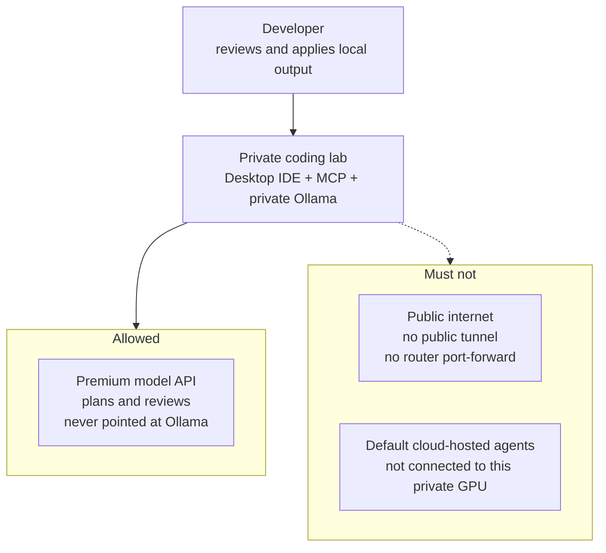
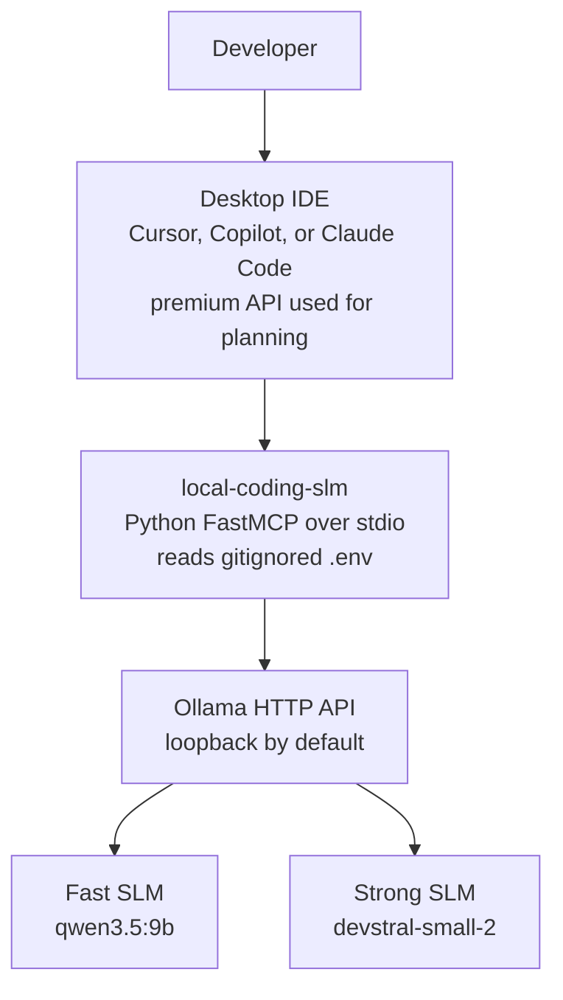
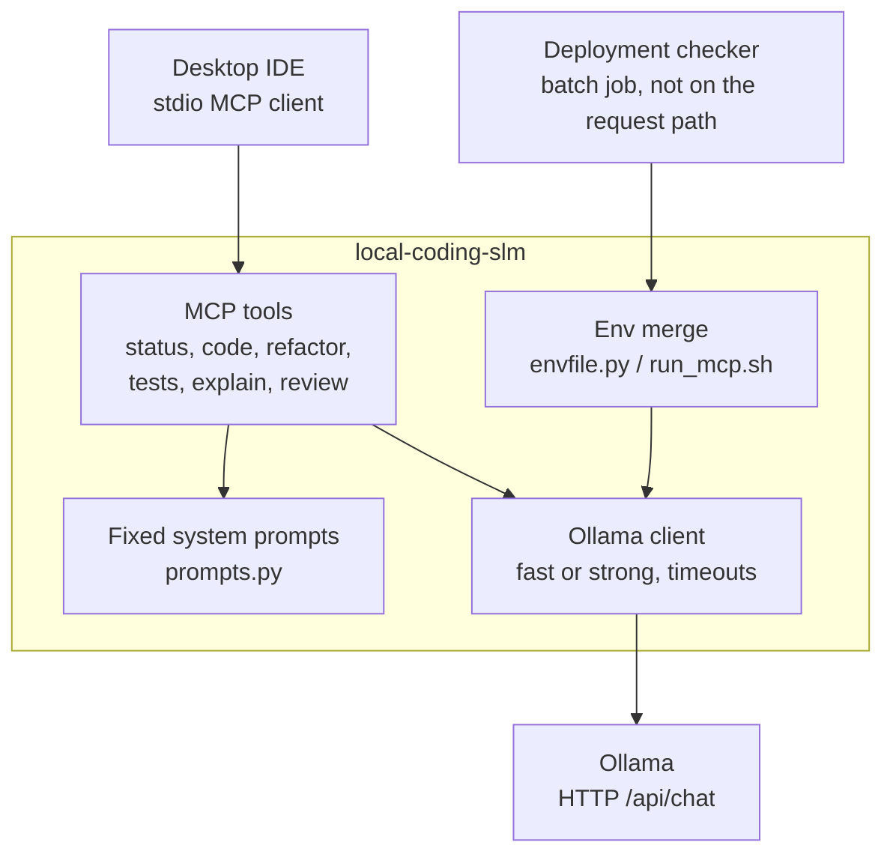
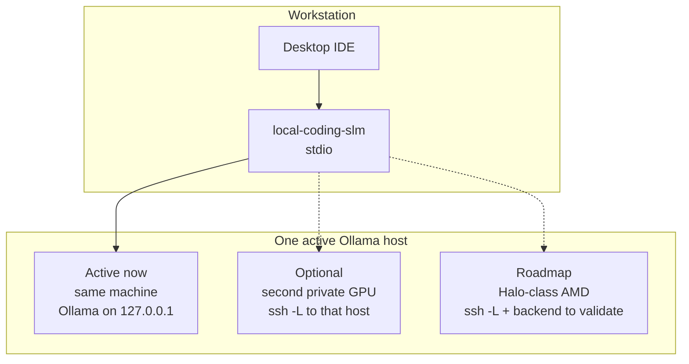

# C4 architecture — local-coding-slm

C4-level views of the system in [spec.md](../spec.md). Drawn as spaced
flowcharts so labels do not sit on boxes. Placeholders only. No
hostnames, LAN addresses, or SKUs.

Halo is **Phase 4**: the same containers, a different inference host.
See [roadmap.md](roadmap.md).

---

## Level 1 — System context

The developer and a **desktop** premium agent stay in control. The
private lab does bounded generation. Cloud-hosted agents and public
tunnels are outside the system and must not reach Ollama.

**Trust boundary.** Inference stays on a private host. The premium
agent still sees the repo and the tool results. Local is not an air gap.

---

## Level 2 — Containers

One MCP process on the workstation. One Ollama HTTP API on the
inference host. Workstation and inference host may be the same
machine.

The MCP server is the only process this repo ships. Ollama is operated,
not implemented here.

---

## Level 3 — Components (`local-coding-slm`)

Runtime path for a tool call. The deployment checker is a separate
batch job on the workstation; it does not sit on the request path.

Tools receive snippets the premium agent chooses. They do not scan the
repository.

---

## Deployment variants (same containers)

Only one inference host is active. Change `OLLAMA_BASE_URL` (and
optionally an SSH forward). Do not add a second MCP server.

Prefer SSH local-forward over a LAN bind. A private-interface bind plus
a workstation-only firewall is optional. Public tunnels are out of
scope.

---

## What these diagrams omit

- Cursor "Override OpenAI Base URL" — not used
- Cloud-agent MCP configuration — unsupported
- Automatic task classification — Phase 3, not drawn
- Real household addresses — vault notes only
